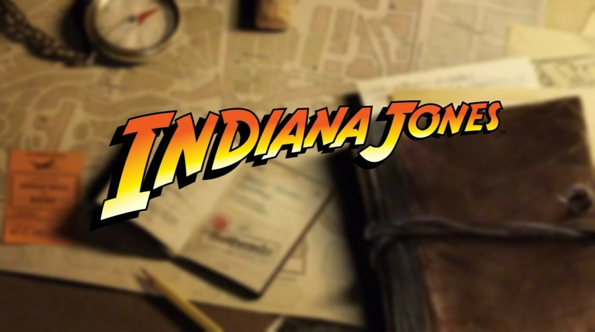

# Save Indiana Jones using JavaScript

A fun game built using JavaScript to check your knowledge of JavaScript itself!

## Rules

- You will win the game when the threat level drops to 0.
- You will lose the game if Indy's health drops to 0.

Three different levels correspond to proficiency levels. That said, at least
currently, there are far more questions available for the beginner level. There
are plans to add more questions for the other levels as well.

## Acknowledgments

The game was my submission for the third-week project for the IronHack boot camp
on web development (full-time, Berlin, Jan-March 2023). I would love to thank
my instructors for their help, and my batchmates for their company and support!
